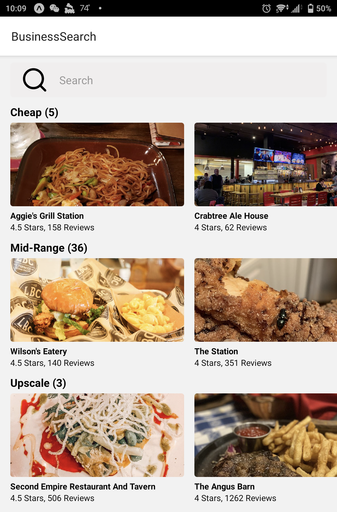
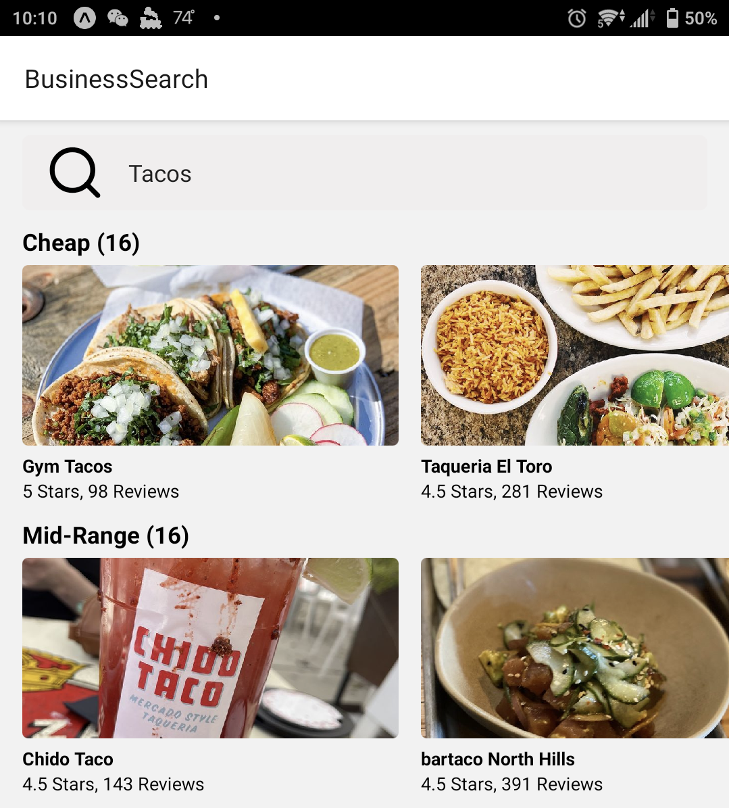

# React Native Food App
This is an app for playing around with React Native

This is currently just setup to run via EXPO and can be run from your phone or browser. It supports some basic functionality via Yelp allowing you to search via specific terms, such as "tacos"

or "french"

and will show number of ratings and stars. It also categorizes them into cost buckets. 

You can search for specific places, such as "Hickory Tavern"

and it will give some images from the restaurant in question

# Requirements
The assumption is that you will provide an api_key via `src/api/yelp_api_key.json` which needs to be created through yelp's developer portal. Once you have this you can install like a normal yarn project `yarn` and then launch the application via `yarn start expo`.